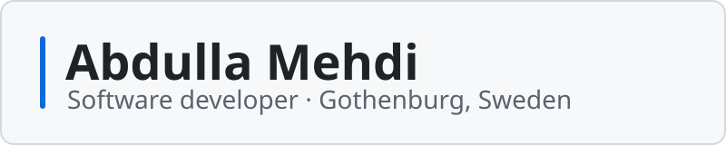

<picture>
  <source media="(prefers-color-scheme: dark)" srcset="assets/banner-dark.svg">
  
</picture>

**I build C#/.NET backends and Python data tools. My thesis finds personal data in Swedish text.**

I have a BSc in Informatics, specialising in software development, from the University of Borås (June 2026). In C# I have built ASP.NET Core APIs with EF Core and clients in Blazor, .NET MAUI and WPF, and in Python I have worked with NLP and local LLMs. Next to my studies I have worked at Volvo Cars since 2021 as an assembly technician and mentor on the engine line, and as deputy team leader since August 2026.

Open to junior roles in C#/.NET backend, data and AI-adjacent development, and application security in the Gothenburg area.

Swedish and English (fluent), Arabic (native).

## Selected work

| Project | What it is and what to look at |
|---|---|
| **[Aegis](https://github.com/Abdriano95/aegis)** Python · thesis | Bachelor's thesis with Johanna Gull. Finds personal data (GDPR art. 4) and sensitive personal data (art. 9) in Swedish free text in layers: regex with checksums, spaCy NER and a local LLM via Ollama. Every finding records which layer and rule produced it. F1 86.9% on 159 synthetic test texts. [Thesis in DiVA](https://urn.kb.se/resolve?urn=urn:nbn:se:hb:diva-36126) |
| **Viskan VEA** Python · .NET 8 · NDA | Collaboration with Viskan Systems, an e-commerce company in Borås, in a team of eight. I was test lead and a backend and ML developer: an ML training pipeline in Python and FastAPI, the VEA.Campaign microservice in .NET 8, and Docker and Kubernetes with CI. The code is under NDA. |
| **[MeTube](https://github.com/Abdriano95/MeTube)** C# · .NET 9 · group | Video platform with a Blazor WebAssembly client and an ASP.NET Core Web API (EF Core, JWT, Azure Blob Storage). In 2026 I replaced the plain-text passwords with salted PBKDF2 hashes from ASP.NET Core's `PasswordHasher` and moved the JWT key to configuration, with tests. |
| **[VIBE](https://github.com/Abdriano95/VIBE-ConcertBookingApp)** C# · .NET 8 and 9 | Concert booking with a .NET MAUI app and an ASP.NET Core Web API on SQL Server. BCrypt password hashing, a global exception middleware and 41 passing xUnit tests. |
| **[Prompt router](https://github.com/Abdriano95/c1tai1-lab2-prompt-router)** Python · LangChain · course lab | An agent workflow that checks each prompt for personal data with regex rules and masks it, then picks which LLM answers based on how sensitive the prompt is. |
| **[Käll-Koll på läget](https://github.com/Jozelle/KallkollPaLaget)** React · TypeScript · hackathon | Detective browser game about source criticism, built by five people in two days at Borås Tech Challenge 2026. I built most of the drag-and-drop evidence board. |
| **[Bilverkstad](https://github.com/Abdriano95/Bilverkstad-CarWorkshopManagementSystem)** C# · WPF · group of two | Car workshop management system in WPF with MVVM, a layered structure and EF Core, built in six weeks with 272 pull requests. |

## Awards and mentoring

- **Borås Tech Challenge 2026:** Best Student Contribution for Käll-Koll på läget ([news](https://www.hb.se/om-hogskolan/aktuellt/nyhetsarkiv/2026/maj/spel-som-gor-skillnad-i-boras-tech-challenge-2026/))
- **Borås Tech Challenge 2025:** Best Student Contribution and Best Pitch for the Unity game The Samaritan ([game](https://abdriano.itch.io/the-samaritan), [news](https://www.hb.se/om-hogskolan/aktuellt/nyhetsarkiv/2025/maj/samhallsnytta-i-fokus-nar-arets-vinnare-av-boras-tech-challenge-utsags/))
- Student mentor at the university's programming club from 2024 to 2026, with weekly C# and Python drop-ins.

## Stack

**C# and .NET:** ASP.NET Core Web API, Entity Framework Core, SQL Server, Blazor WebAssembly, .NET MAUI, WPF, xUnit, Moq 
**Python:** spaCy, Ollama, LangChain, FastAPI, pytest 
**Other:** Docker, Kubernetes, GitHub Actions, Azure Blob Storage, React, TypeScript, Unity, Git
